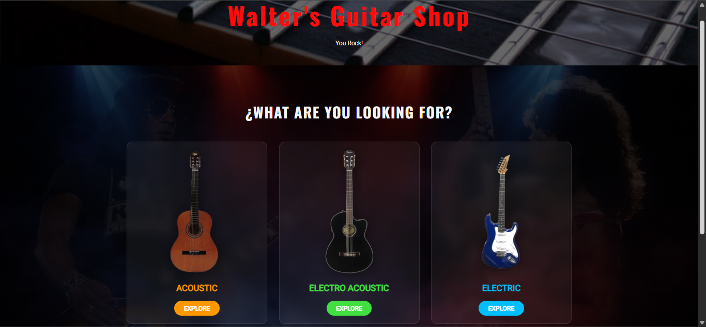
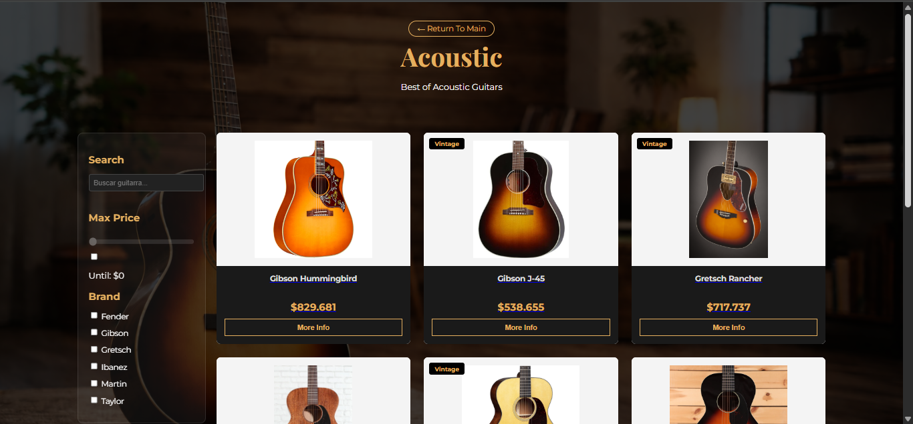
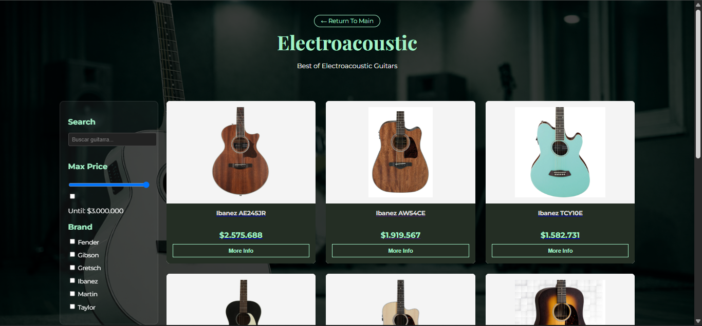
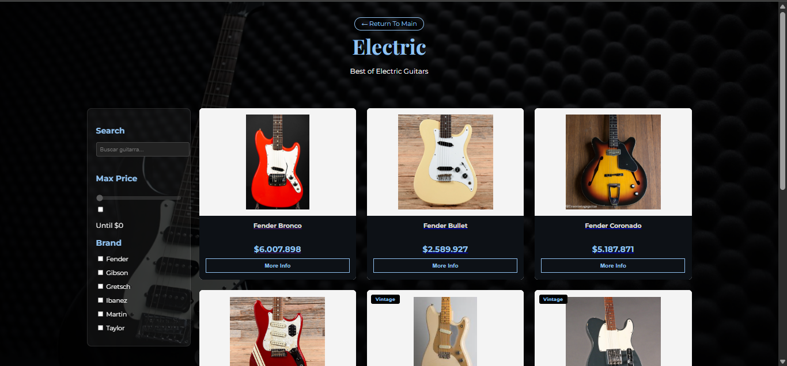
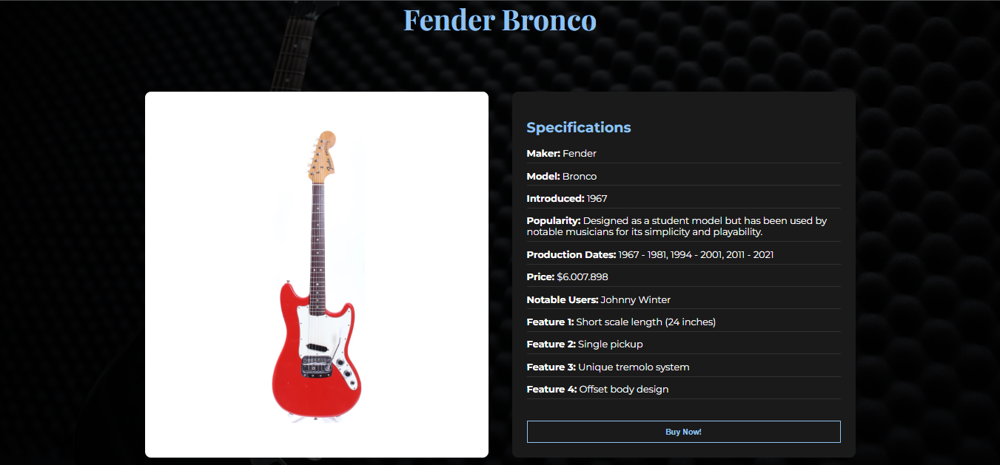
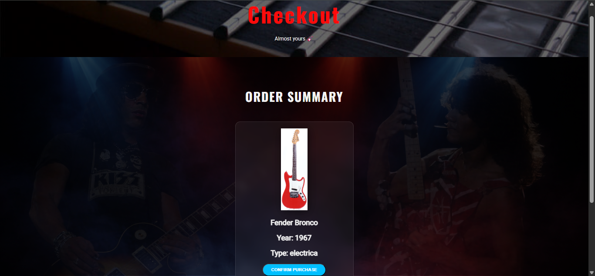
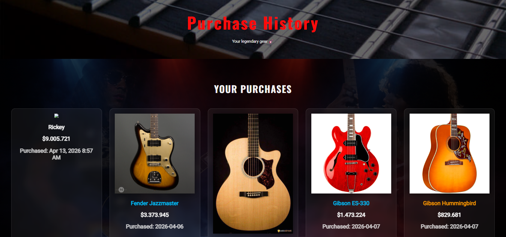

# 🎸 Guitar Shop

## Proyecto Final

**Guitar Shop** es una tienda virtual de guitarras desarrollada como proyecto final, cuyo objetivo es ofrecer una experiencia de navegación moderna e intuitiva para los amantes de la música. La aplicación permite explorar diferentes modelos de guitarras, consultar información detallada de cada instrumento y realizar un proceso completo de compra mediante un carrito de compras interactivo.

El proyecto fue desarrollado utilizando tecnologías web modernas para el frontend y una API REST construida con Laravel para la gestión de la información de los productos.

---

# 📌 Características principales

* Catálogo dinámico de guitarras.
* Visualización de productos organizados por categorías.
* Página de detalle para cada guitarra.
* Información técnica de cada instrumento.
* Lista de características principales.
* Acabados (Finishes) disponibles.
* Músicos destacados que utilizan cada modelo.
* Integración de videos de demostración y review.
* Carrito de compras dinámico.
* Modificación de cantidades dentro del carrito.
* Cálculo automático del total de la compra.
* Proceso de checkout.
* Diseño responsive para diferentes tamaños de pantalla.

---

# 🖼️ Capturas del proyecto

## Página principal



---

## Catálogo de guitarras

### Acústicas



---

### Electroacústicas



---

### Eléctricas



---

## Detalle del producto


---



---

## Sección de Compra



---

## Historial de Compra



---

# 🛠️ Tecnologías utilizadas

## Frontend

* HTML5
* CSS3
* JavaScript (ES6)

## Backend

* Laravel
* API REST

## Base de datos

* MySQL

---

# 📂 Estructura general del proyecto

```
Tienda_Guitarras
│
├── assets/
├── content/
├── imagenes/
├── jvscript/
├── styles/
├── mi_api/
└── index.html
```

---

# 🚀 Instalación

## 1. Clonar el repositorio

```
git clone <URL_DEL_REPOSITORIO>
```

---

## 2. Instalar dependencias del backend

Entrar a la carpeta del proyecto Laravel:

```
cd mi_api
```

Instalar dependencias:

```
composer install
```

---

## 3. Configurar el entorno

Crear el archivo `.env` y configurar la conexión con la base de datos.

---

## 4. Generar la clave de la aplicación

```
php artisan key:generate
```

---

## 5. Ejecutar las migraciones

```
php artisan migrate
```

---

## 6. Iniciar el servidor Laravel

```
php artisan serve
```

---

## 7. Abrir la aplicación

Abrir el archivo:

```
index.html
```

o acceder mediante el servidor web configurado para el proyecto.

---

# 🎯 Objetivos del proyecto

Este proyecto fue desarrollado con el propósito de integrar conocimientos adquiridos durante el curso, aplicando conceptos relacionados con:

* Desarrollo Frontend.
* Consumo de APIs REST.
* Gestión dinámica del DOM mediante JavaScript.
* Manejo de bases de datos.
* CRUD de información.
* Integración entre Frontend y Backend.
* Buenas prácticas de organización del código.

---

# 👨‍💻 Autor

**Juan Esteban Hernández Gualtero**
